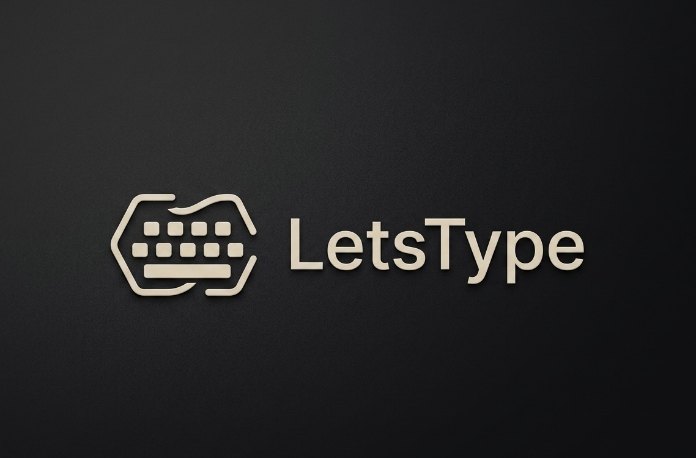
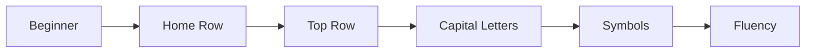
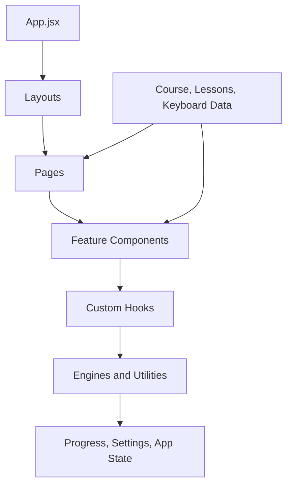

<div align="center">
  <br />
  
  <br />
  <br />

  <h1>LetsType</h1>

  <p>
    <strong>A premium touch-typing mastery platform built with React and modern frontend architecture.</strong>
  </p>

  <p>
    Structured lessons, adaptive practice, finger guidance, analytics, smart coaching, XP progression,
    streaks, sound profiles, and a responsive desktop workspace designed to make typing improvement feel focused,
    measurable, and rewarding.
  </p>

  <p>
    <a href="#-features">Features</a>
    &middot;
    <a href="#-learning-journey">Learning Journey</a>
    &middot;
    <a href="#-installation">Installation</a>
    &middot;
    <a href="#-roadmap">Roadmap</a>
  </p>

  <br />

  
  
  
  
  
  
</div>

<br />

---

## ✨ Why LetsType

Most typing tools stop at speed tests. **LetsType is designed as a complete learning system**: it teaches posture and finger placement, builds muscle memory through structured lessons, adapts practice around weak keys, and translates every session into clear feedback.

| What makes it different | How it helps learners |
| --- | --- |
| **Guided progression** | Learners move through home row, top row, capitals, symbols, and fluency in a deliberate path. |
| **Finger-first learning** | Visual finger guidance connects each key to the correct finger before bad habits settle in. |
| **Adaptive practice** | Practice content can respond to weak keys, accuracy drops, and session history. |
| **Strict typing mode** | Learners build discipline by correcting mistakes before moving forward. |
| **Analytics-driven coaching** | Accuracy, speed, confidence, weak keys, and trends turn practice into insight. |
| **Premium workspace UI** | A focused desktop experience keeps lessons, practice, progress, and settings within reach. |

---

## 🚀 Features

| Learning | Practice | Progression | Experience |
| --- | --- | --- | --- |
| Structured lessons | Practice workspace | XP system | Modern premium UI |
| Lesson intro panels | Strict typing mode | Streak tracking | Responsive desktop layout |
| Finger positioning guide | Adaptive drills | Achievement logic | Motion-aware interactions |
| Visual keyboard support | Weak-key review | Mastery levels | Sound profiles |
| Course progress rail | Quick practice cards | Session history | Workspace settings |
| Guided row progression | Custom practice logic | Confidence tracking | Clean app shell |

<details>
<summary><strong>Feature depth</strong></summary>

### Learning System

- Lesson-based course flow
- Finger positioning guidance
- Keyboard visualization
- Home row, top row, capitals, symbols, and fluency progression
- Lesson intro content for guided onboarding

### Practice Engine

- Focused practice workspace
- Strict typing behavior
- Adaptive training generation
- Weak-key targeting
- Session results and history
- Typing caret, live stats, and feedback loops

### Analytics & Coaching

- Accuracy trends
- Weak-key clusters
- Finger performance
- Confidence badges
- Performance summaries
- Smart recommendations
- Session insights

</details>

---

## 🖼️ Screenshots

> Add production screenshots here when the UI is ready for repository presentation. Recommended image size: **1600 x 1000** or larger for crisp GitHub rendering.

| Area | Preview | Suggested path |
| --- | --- | --- |
| Landing Page | `Add screenshot` | `docs/screenshots/landing.png` |
| Lessons | `Add screenshot` | `docs/screenshots/lessons.png` |
| Practice | `Add screenshot` | `docs/screenshots/practice.png` |
| Analytics | `Add screenshot` | `docs/screenshots/analytics.png` |
| Settings | `Add screenshot` | `docs/screenshots/settings.png` |

```md


```

---

## 🧭 Learning Journey

LetsType is built around a progression that starts with fundamentals and expands toward confident fluency.



| Stage | Focus | Outcome |
| --- | --- | --- |
| **Beginner** | Orientation, rhythm, and key familiarity | Learner understands the typing workspace. |
| **Home Row** | Core finger placement and muscle memory | Learner builds a stable typing foundation. |
| **Top Row** | Reach, recovery, and hand discipline | Learner expands range without losing posture. |
| **Capital Letters** | Shift coordination and accuracy | Learner handles case changes smoothly. |
| **Symbols** | Precision with punctuation and special keys | Learner becomes ready for real-world typing. |
| **Fluency** | Speed, consistency, and confidence | Learner practices for reliable performance. |

---

## ⌨️ Practice System

LetsType treats practice as a workspace, not a single text box. Practice is organized around modes, goals, and feedback loops that help learners improve deliberately.

| Practice area | Description |
| --- | --- |
| **Guided drills** | Focused exercises tied to the active lesson path. |
| **Adaptive practice** | Generated sessions that can emphasize weak keys and recent mistakes. |
| **Strict mode** | Accuracy-first typing where mistakes must be corrected. |
| **Quick practice** | Lightweight sessions for daily repetition. |
| **Weak-key review** | Targeted practice around keys that need reinforcement. |
| **Session results** | Post-session feedback for speed, accuracy, consistency, and improvement. |

---

## 📊 Analytics & Coaching

Analytics in LetsType are designed to answer the most useful learning question: **what should I practice next?**

| Signal | Coaching value |
| --- | --- |
| **WPM / speed** | Shows fluency gains over time. |
| **Accuracy** | Highlights whether speed is outpacing control. |
| **Weak keys** | Identifies exact keys that need repetition. |
| **Finger performance** | Connects mistakes to hand and finger habits. |
| **Confidence score** | Measures typing stability beyond raw speed. |
| **Recommendations** | Converts data into the next best practice action. |

---

## 🏗️ Architecture

LetsType is organized as a modern React frontend with clear separation between pages, layouts, components, data, hooks, stores, and utilities.

```txt
TypeLearner/
+-- README.md
+-- frontend/
    +-- public/
    |   +-- letstype-logo.png
    |   +-- favicon.svg
    |   +-- icons.svg
    +-- src/
    |   +-- components/
    |   |   +-- adaptive/
    |   |   +-- analytics/
    |   |   +-- audio/
    |   |   +-- brand/
    |   |   +-- course/
    |   |   +-- finger-guide/
    |   |   +-- keyboard/
    |   |   +-- layout/
    |   |   +-- practice/
    |   |   +-- settings/
    |   +-- data/
    |   +-- hooks/
    |   +-- layouts/
    |   +-- pages/
    |   +-- store/
    |   +-- utils/
    |   +-- App.jsx
    |   +-- index.css
    |   +-- main.jsx
    +-- index.html
    +-- package.json
    +-- vite.config.js
```

### Frontend Flow



---

## 🧰 Tech Stack

| Layer | Technology | Purpose |
| --- | --- | --- |
| **Framework** | React | Component-driven UI architecture |
| **Build Tool** | Vite | Fast development and optimized production builds |
| **Language** | JavaScript / ESM | Modern frontend development |
| **Styling** | Tailwind CSS | Utility-first premium interface styling |
| **Motion** | Framer Motion | Smooth transitions and interaction polish |
| **Routing** | React Router | Client-side app navigation |
| **Quality** | ESLint | Static analysis and code quality checks |

---

## ⚙️ Installation

Clone the repository and install the frontend dependencies.

```bash
git clone <repository-url>
cd TypeLearner/frontend
npm install
```

---

## 🧪 Development

Run the local development server:

```bash
npm run dev
```

Create a production build:

```bash
npm run build
```

Preview the production build locally:

```bash
npm run preview
```

Run linting:

```bash
npm run lint
```

---

## 🗺️ Roadmap

LetsType is positioned to evolve from a polished frontend learning experience into a full-stack typing mastery platform.

| Status | Area | Direction |
| --- | --- | --- |
| ✅ | Premium frontend | React, Vite, Tailwind, analytics, practice, lessons |
| 🔜 | Backend API | User accounts, saved progress, session sync |
| 🔜 | PostgreSQL | Persistent profiles, lesson state, analytics history |
| 🔜 | Docker | Containerized development and deployment workflow |
| 🔜 | Kubernetes | Production-grade orchestration |
| 🔜 | Amazon EKS | Cloud-native cluster deployment |
| 🔜 | ArgoCD | GitOps-based delivery |
| 🔜 | CI/CD | Automated quality checks, builds, and deploys |

<details>
<summary><strong>Future product ideas</strong></summary>

- Multi-device progress sync
- Typing goals and weekly plans
- Custom lesson packs
- Advanced heatmaps
- Team and classroom dashboards
- Competitive typing challenges
- Accessibility-first typing modes
- Importable practice text

</details>

---

## 📁 Repository Structure

```txt
frontend/
+-- public/
|   +-- favicon.svg
|   +-- icons.svg
|   +-- letstype-logo.png
+-- src/
|   +-- components/
|   |   +-- adaptive/
|   |   +-- analytics/
|   |   +-- audio/
|   |   +-- brand/
|   |   +-- course/
|   |   +-- finger-guide/
|   |   +-- keyboard/
|   |   +-- layout/
|   |   +-- practice/
|   |   +-- settings/
|   +-- data/
|   |   +-- course.js
|   |   +-- fingerMap.js
|   |   +-- keyboardLayout.js
|   |   +-- lessonIntroSlides.js
|   |   +-- lessons.js
|   |   +-- typingWords.js
|   +-- hooks/
|   |   +-- useAdaptiveLearning.js
|   |   +-- useAnalyticsEngine.js
|   |   +-- useGamification.js
|   |   +-- usePracticeEngine.js
|   |   +-- useTyping.js
|   |   +-- useTypingSession.js
|   +-- layouts/
|   |   +-- AppShell.jsx
|   |   +-- LearningWorkspace.jsx
|   |   +-- MainLayout.jsx
|   |   +-- SidebarNavigation.jsx
|   |   +-- WorkspacePanel.jsx
|   +-- pages/
|   |   +-- Home.jsx
|   |   +-- Lessons.jsx
|   |   +-- NotFound.jsx
|   |   +-- Practice.jsx
|   |   +-- Profile.jsx
|   +-- store/
|   |   +-- appStore.js
|   |   +-- progressStore.js
|   |   +-- settingsStore.js
|   +-- utils/
|   |   +-- adaptivePracticeGenerator.js
|   |   +-- analyticsCalculator.js
|   |   +-- audioMixer.js
|   |   +-- practiceAnalytics.js
|   |   +-- recommendationEngine.js
|   |   +-- sessionAnalyzer.js
|   |   +-- typingMetrics.js
|   |   +-- xpCalculator.js
|   +-- App.jsx
|   +-- index.css
|   +-- main.jsx
+-- eslint.config.js
+-- index.html
+-- package-lock.json
+-- package.json
+-- vite.config.js
```

---

## 🤝 Contributing

Contributions are welcome. LetsType aims to stay polished, accessible, and easy to understand.

Before opening a pull request:

1. Keep changes focused and easy to review.
2. Follow the existing frontend architecture.
3. Test the experience locally with `npm run dev`.
4. Run `npm run build` before submitting larger UI or logic changes.
5. Include screenshots or screen recordings for visual changes.

Suggested contribution areas:

| Area | Examples |
| --- | --- |
| **Lessons** | New drills, better progression, richer intro content |
| **Practice** | New practice modes, stricter accuracy options, custom text |
| **Analytics** | Better recommendations, richer charts, improved summaries |
| **Accessibility** | Keyboard navigation, contrast, reduced motion, screen reader polish |
| **Platform** | Backend, persistence, deployment, CI/CD |

---

<div align="center">
  <strong>LetsType</strong>
  <br />
  Build speed. Protect accuracy. Master the keyboard.
</div>
